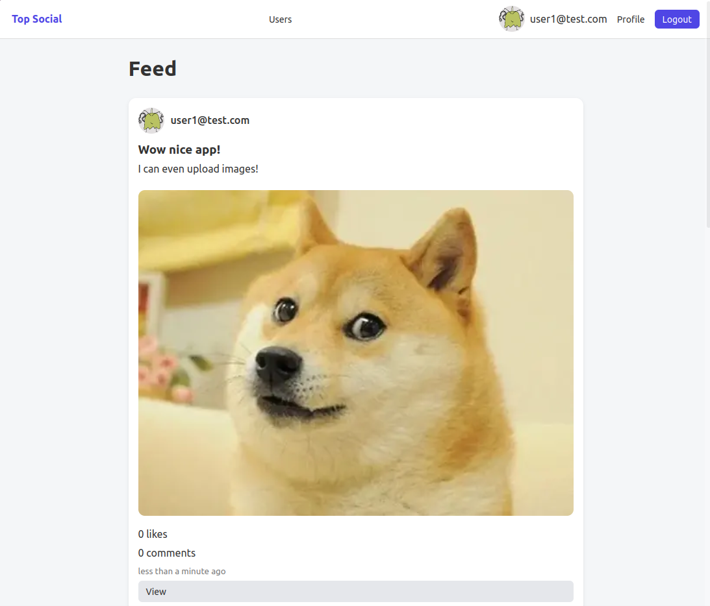
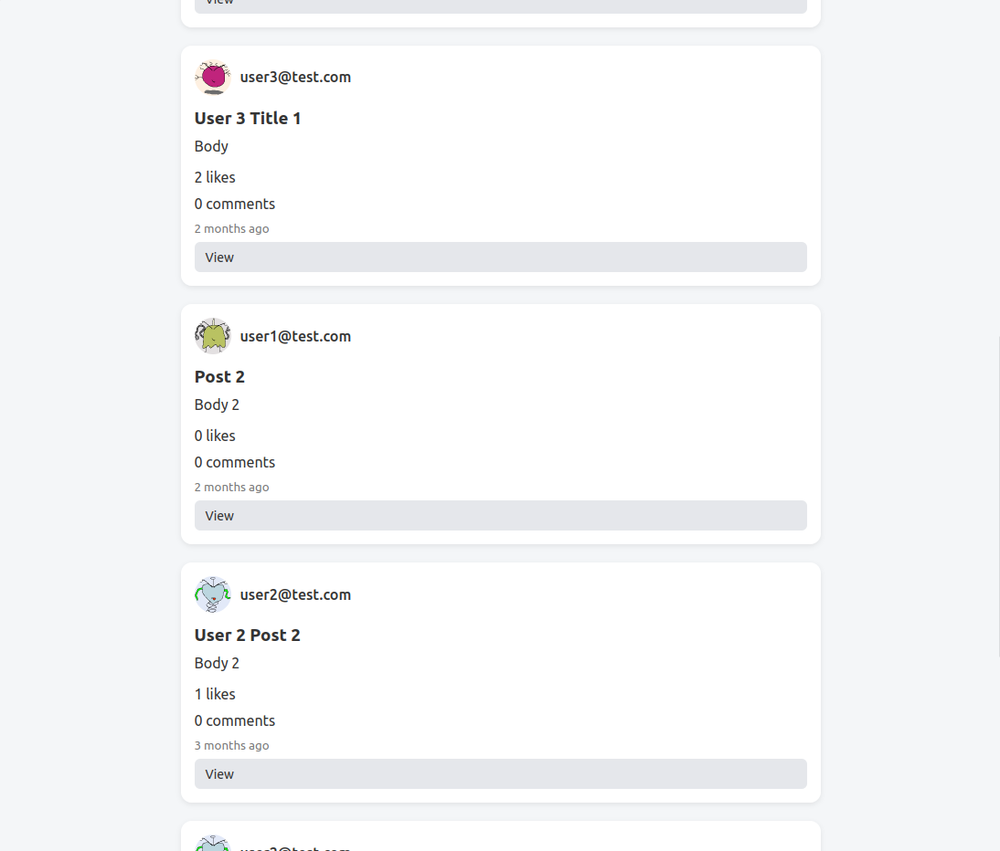
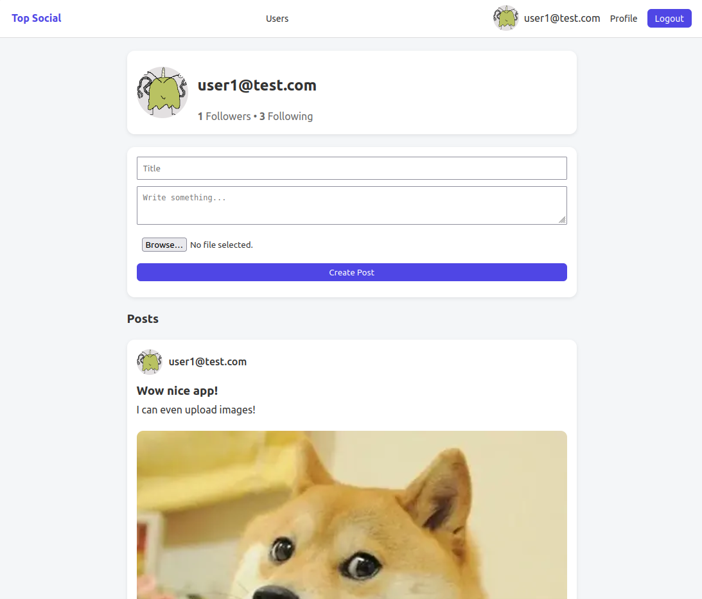
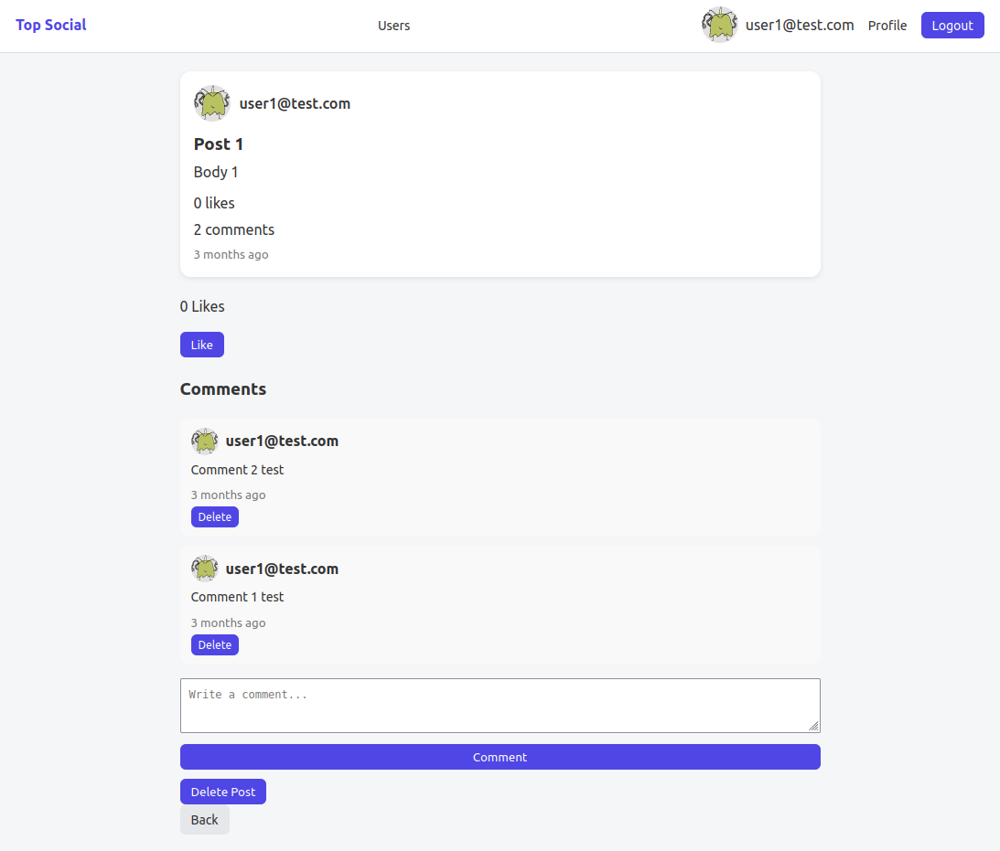
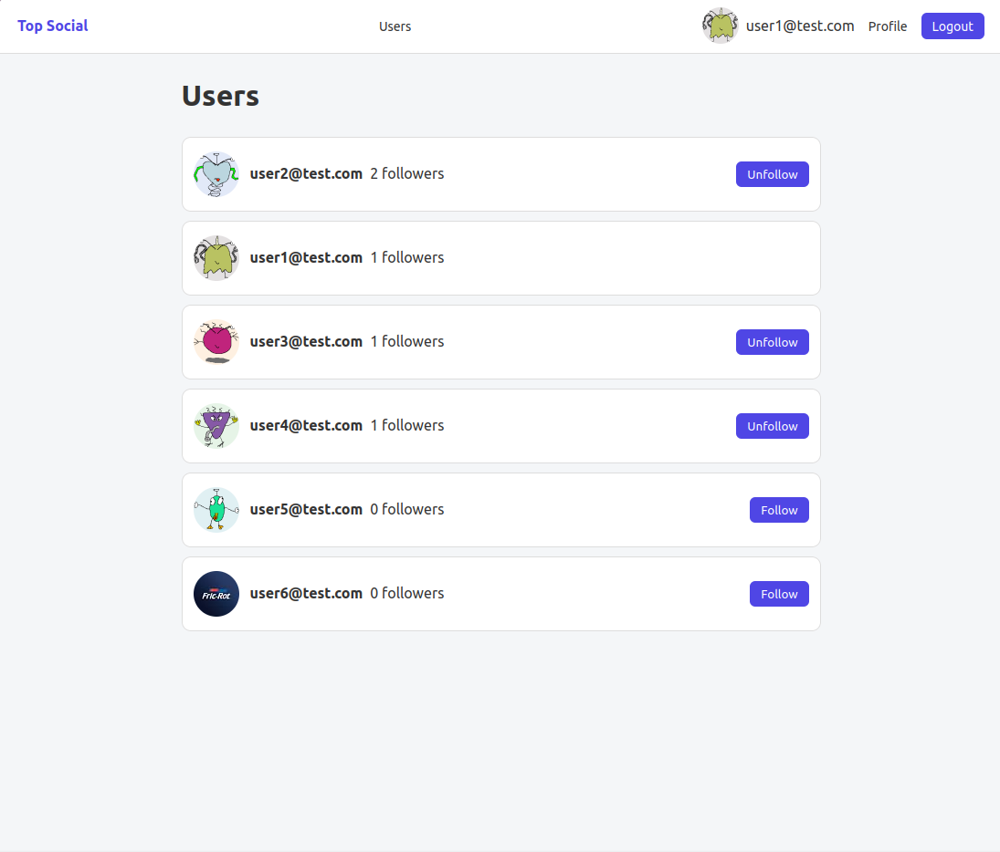
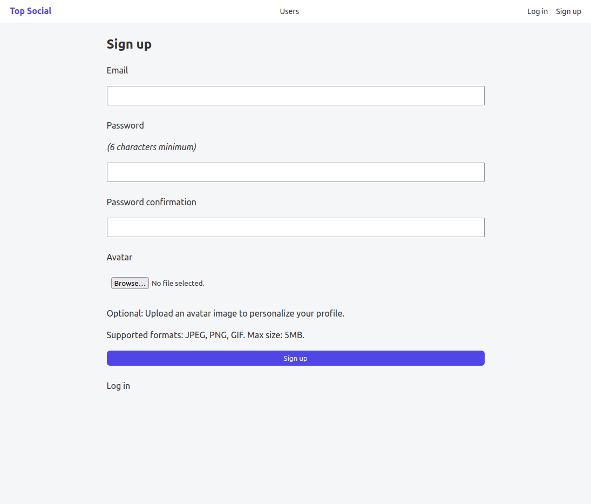

# Rails Social Network

A full-stack social media application built with Ruby on Rails.

This project was originally created as part of The Odin Project curriculum and later expanded with additional features, production deployment, image uploads, and a more polished UI.

## Live Demo

[https://rails-social-network.onrender.com](https://rails-social-network.onrender.com)

---

# Features

## Authentication

* User sign up and login
* Secure authentication with Devise
* Session management

## Social Features

* Follow / unfollow users
* Personalized feed based on followed users
* User profiles

## Posts

* Create posts
* Upload images with posts
* View posts from other users

## Interactions

* Like posts
* Comment on posts
* Like comments

## Media Uploads

* Image uploads using Active Storage
* Local storage support
* Cloudinary integration support

## UI / UX

* Responsive layout
* Styled views and navigation
* Flash messages and validations

---

# Tech Stack

## Backend

* Ruby
* Ruby on Rails 8
* PostgreSQL

## Frontend

* ERB Templates
* HTML5
* CSS3
* Stimulus
* Turbo

## Authentication & Storage

* Devise
* Active Storage
* Cloudinary

## Deployment

* Render

---

# Screenshots

## Post



## Feed



## User Profile



## Comments Creation



## Users list



## Sign-Up



---

# Installation

Clone the repository:

```bash
git clone git@github.com:bachatron/rails-social-network.git
cd rails-social-network
```

Install dependencies:

```bash
bundle install
```

Setup the database:

```bash
bin/rails db:create
bin/rails db:migrate
bin/rails db:seed
```

Start the server:

```bash
bin/rails server
```

Open:

```text
http://localhost:3000
```

---

# Environment Variables

If using Cloudinary in production:

```env
CLOUDINARY_CLOUD_NAME=
CLOUDINARY_API_KEY=
CLOUDINARY_API_SECRET=
```

---

# What I Learned

This project helped me gain practical experience with:

* Rails MVC architecture
* Authentication systems
* Database associations
* Building social features
* Active Storage and image uploads
* Production deployment
* Asset pipeline and Rails 8 configuration
* PostgreSQL configuration in production
* GitHub Actions and CI troubleshooting
* Managing environment variables securely

---

# Future Improvements

* Real-time notifications
* Direct messaging
* Infinite scrolling feed
* Better mobile responsiveness
* Search functionality
* Image optimization
* User avatars

---

# Author

GitHub: [https://github.com/bachatron](https://github.com/bachatron)
